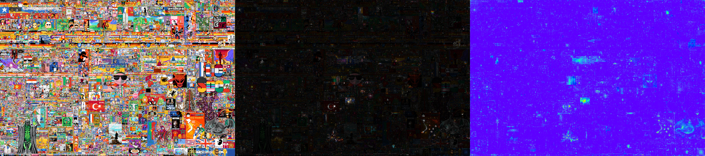

# Vis-Project

## About
This python projects provides helper functions to convert [CSV data from Reddit's r/place 2023](https://www.reddit.com/r/place/comments/15bjm5o/rplace_2023_data/) to less verbose but faster iterable binaries. It also has tools to generate images visualizing the development of the canvas over time, images where pixel activity is highlighted vis via brightness and via thermal map.